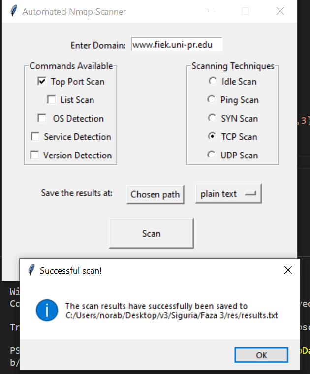

# SI_Gr6

## Pershkrimi i projektit

Ky program paraqet nje GUI aplikacion permes te cilit kryejme skenime me veglen Nmap. Programi eshte i shkruar ne gjuhen **Python**, ndersa GUI eshte realizuar me librarine **Tkinter**.


## Parakushtet

Parakusht qe aplikacioni te funksionoje eshte qe paraprakisht te jete instaluar vegla Nmap.
Ne program, pervec built-in librarive, kemi perdorur edhe librari te tjera ndihmese te cilat jane te listuara tek fajlli **requirements.txt**. 
Librarite e perdorura i instalojme me ane te komandes:
``` 
$ pip install -r requirements.txt
```

## Perdorimi dhe ekzekutimi i programit

Programi ekzekutohet permes komandes:
``` 
$ python3 nmap.py
```
Perdoruesit i ipet mundesia qe ta shkruaje nje URL/IPV4 valide e cila validohet nga funksionet perkatese. Pas kesaj, perdouresi zgjedh tekniken e skenimit(by default TCP scan), komandat shtese te listuara ne anen e majte dhe ne fund direktoriumin ku deshiron t'i ruaje rezultatet, te cilat mund te ruhen si *txt* apo *JSON file*. Ne folderin e dhene gjenerohet nje file me emrin results.extension ne te cilin ruhen te gjitha skenimet. 

Testimet ekzekutohen permes komandes:
``` 
$ python3 test_nmap.py
```
Per shkak se programi jone nuk eshte aq kompleks dhe nuk permban nje numer te madh te field-ave, numri i testeve te kryera eshte relativisht i vogel, mirepo te gjitha fushat dhe elementet tjera jane te validuara.
